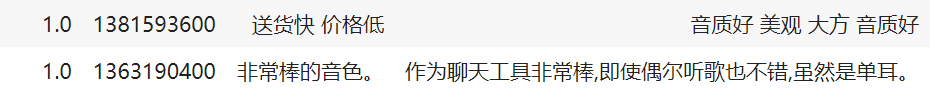

# README

### Recommendation system based on review analysis

#### Env:

+ colab
+ pytorch+transformer

#### Data

+ Data source: https://github.com/SophonPlus/ChineseNlpCorpus
+ df.sample(n=16000, replace=False)

+ preprocess: 

  + manually revise the inconsistency between comments and ratings

    

  + dataset split

    +  frac: 8-1-1

#### Model:

+ input: title+comment.
+ output: predict ratings.

+ Pre-trained model "bert-base-chinese"
  + num_label: 5
  + dropout: 0.2
+ tokenization params:
  + reference: https://huggingface.co/docs/transformers/main/en/model_doc/bert#transformers.BertForMaskedLM
  + padding = True
  + truncation = True
  + token MAX_LEN: 256
+ training params:
  + batch size: 16
  + EPOCHS: 5
  + lr: 1e-5

#### Performance

###### classification acc

The final classification accuracy is about 54%-57% on test set. The reason accounting for this accuracy is that the domain of rating 4 and rating 5, rating 1 and rating 2 is largely overlapped. The gap between a 5-star rating and a 4-star one could hardly be distinguished even by human.

###### RMSE

Though the accuracy seems not good enough, the RMSE of the model is 0.87, which is less than 1. It indicates the model could predict the rating with the comment, with an error by average less than 1 rating level. 